# CS3: Open Source Research Projects
This page highlights the open source research conducted at the NSF-Funded Center for Smart Streetscapes (CS3).

## Datasets

### RSSI-based Passive Localization in the Wild, at Streetscape Scales

  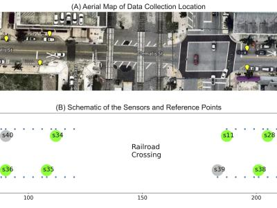

**Download:** https://ieee-dataport.org/documents/rssi-based-passive-localization-wild-streetscape-scales

**Paper:** https://ieeexplore.ieee.org/document/10854656

### OpenMesh Dataset

  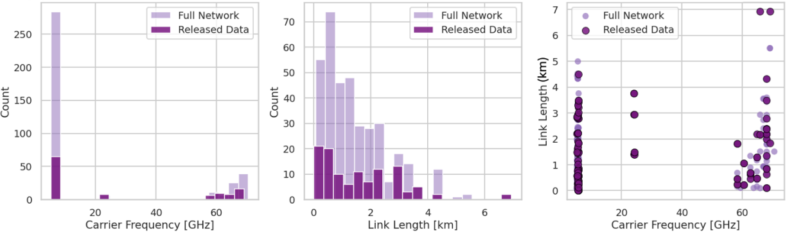

**Download:** https://zenodo.org/records/15268341

**Preprint:** https://essd.copernicus.org/preprints/essd-2025-238/

### ParallelDomain Video Dataset

  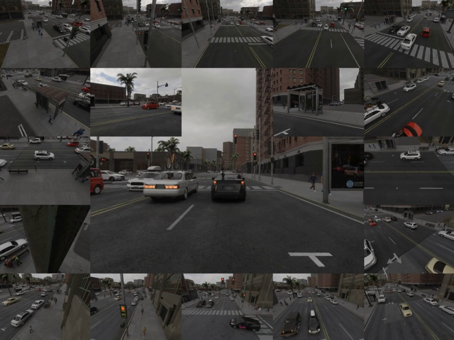

**Download:** [Follow the Instructions](https://gcd.cs.columbia.edu/#datasets)

**Project Page:** https://gcd.cs.columbia.edu/ 

### M3Act

  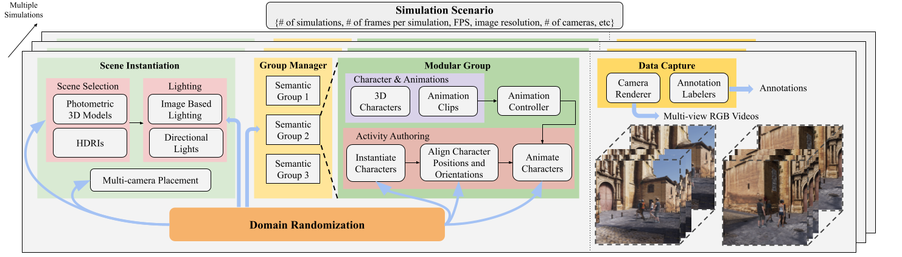

**Download:** [Follow the Instructions](https://github.com/cjerry1243/M3Act/tree/master/gag)

**Project Page:** https://cjerry1243.github.io/M3Act/ 

**Paper:** https://openaccess.thecvf.com/content/CVPR2024/papers/Chang_Learning_from_Synthetic_Human_Group_Activities_CVPR_2024_paper.pdf 

### Constellation

  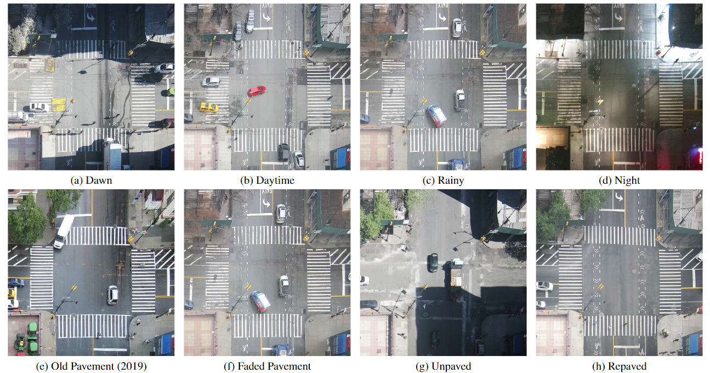

**Download:** [HuggingFace](https://huggingface.co/datasets/Center-for-Smart-Streetscapes-CS3/constellation)

### Boundless

  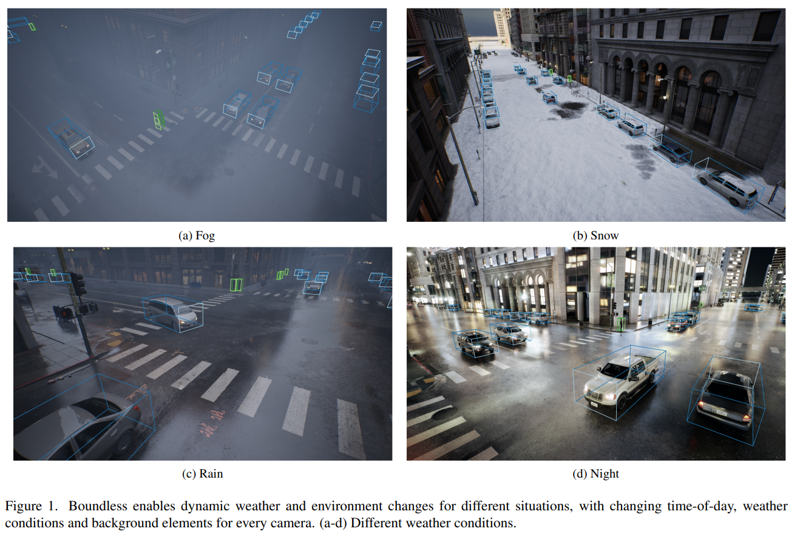

**Download Drone-View Dataset:** [HuggingFace](https://huggingface.co/datasets/mehmetkeremturkcan/boundless-drone)

**Download High-Altitude Dataset:** [HuggingFace](https://huggingface.co/datasets/mehmetkeremturkcan/boundless-i2x)

## Research Projects

### Cookie Monster

  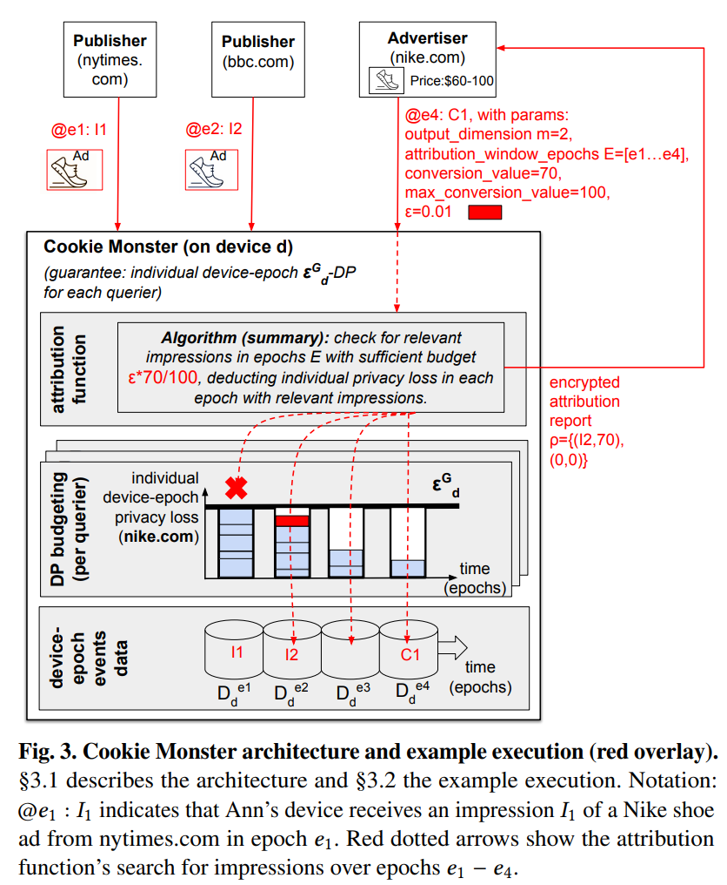

**Paper:** https://dl.acm.org/doi/pdf/10.1145/3694715.3695965

**Repository:** https://github.com/columbia/cookiemonster

### DPack

  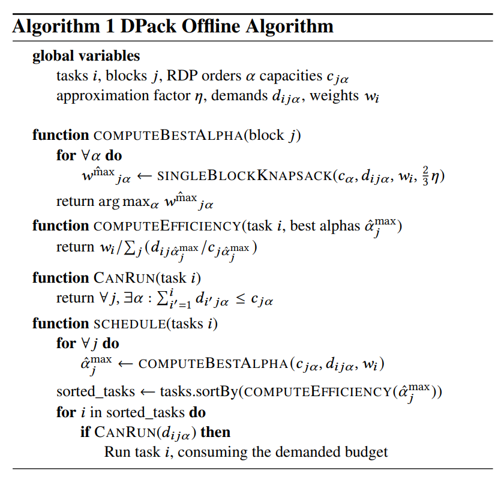

**Paper:** https://symbioticlab.org/publications/files/dpack:eurosys25/dpack-eurosys25.pdf 

**Repository:** https://github.com/columbia/dpack 

### Generative Camera Dolly

  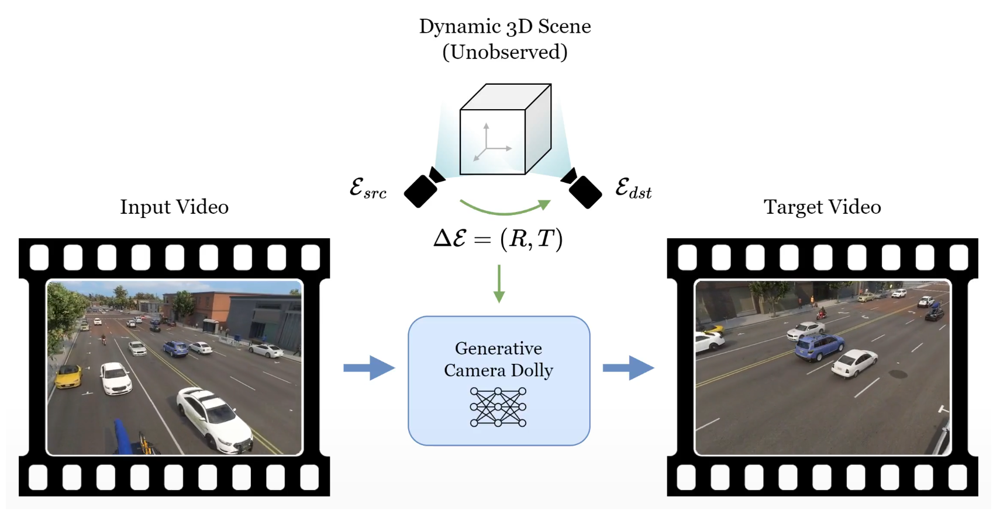

**Project Page:** https://gcd.cs.columbia.edu/ 

**Paper:** https://gcd.cs.columbia.edu/GCD_v4.pdf 

**Repository:** https://github.com/basilevh/gcd

### TeD-SPAD: Temporal Distinctiveness for Self-supervised Privacy-preservation for video Anomaly Detection

  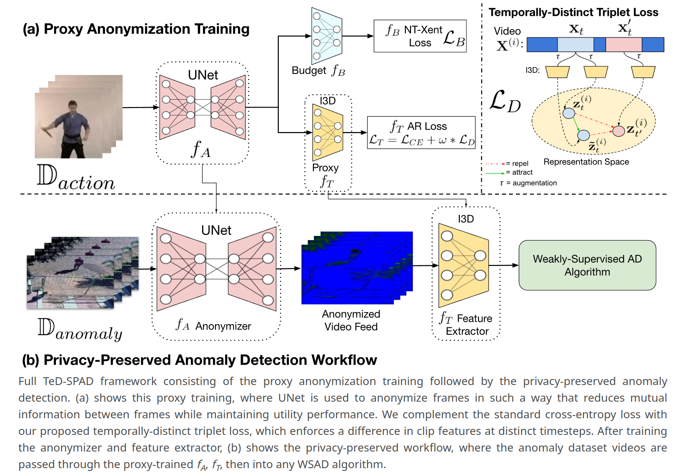

**Project Page:** https://joefioresi718.github.io/TeD-SPAD_webpage/

**Paper:** https://openaccess.thecvf.com/content/ICCV2023/html/Fioresi_TeD-SPAD_Temporal_Distinctiveness_for_Self-Supervised_Privacy-Preservation_for_Video_Anomaly_Detection_ICCV_2023_paper.html 

**Repository:** https://github.com/UCF-CRCV/TeD-SPAD

### M3Act

  

**Project Page:** https://cjerry1243.github.io/M3Act/ 

**Paper:** https://openaccess.thecvf.com/content/CVPR2024/papers/Chang_Learning_from_Synthetic_Human_Group_Activities_CVPR_2024_paper.pdf 

**Repository:** https://github.com/cjerry1243/M3Act 

### Massive MIMO Direction-of-Arrival

  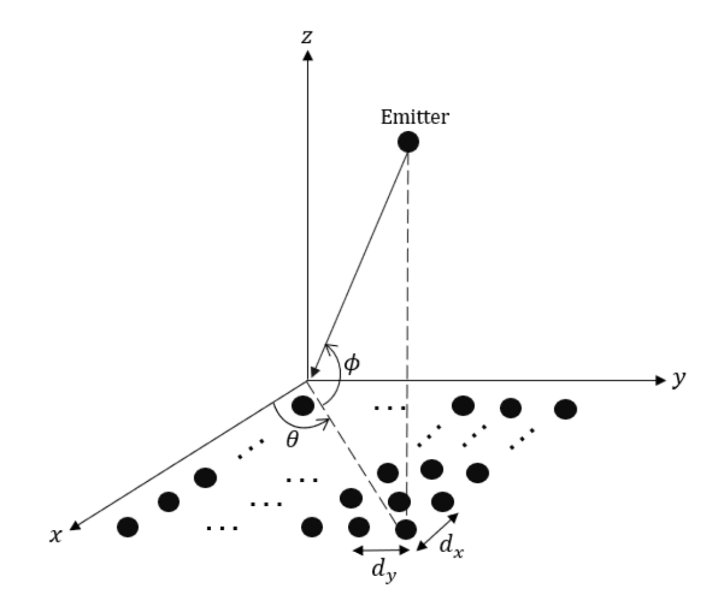

**Paper:** https://github.com/C2A2-at-Florida-Atlantic-University/icasp/blob/main/assets/manuscript.pdf 

**Repository:** https://github.com/C2A2-at-Florida-Atlantic-University/icasp/tree/main

### MobLoc: CSI-based Location Fingerprinting with MUSIC

  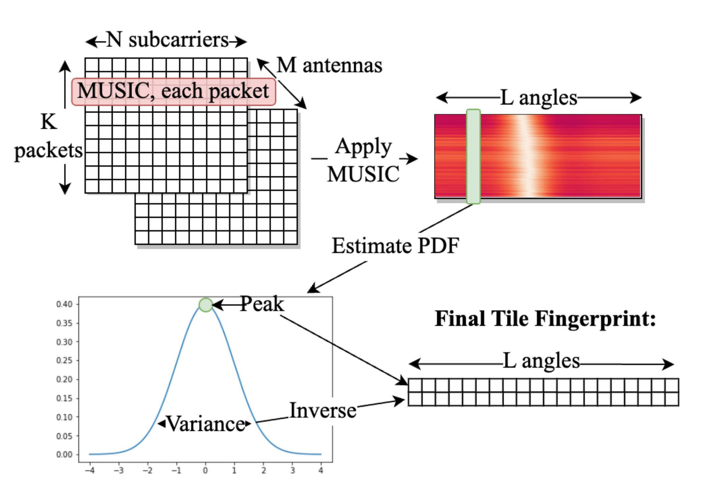

**Paper:** https://ieeexplore.ieee.org/document/10333260 

**Repository:** https://github.com/I-SENSE/mobloc-paper

### SOD-YOLOv8

  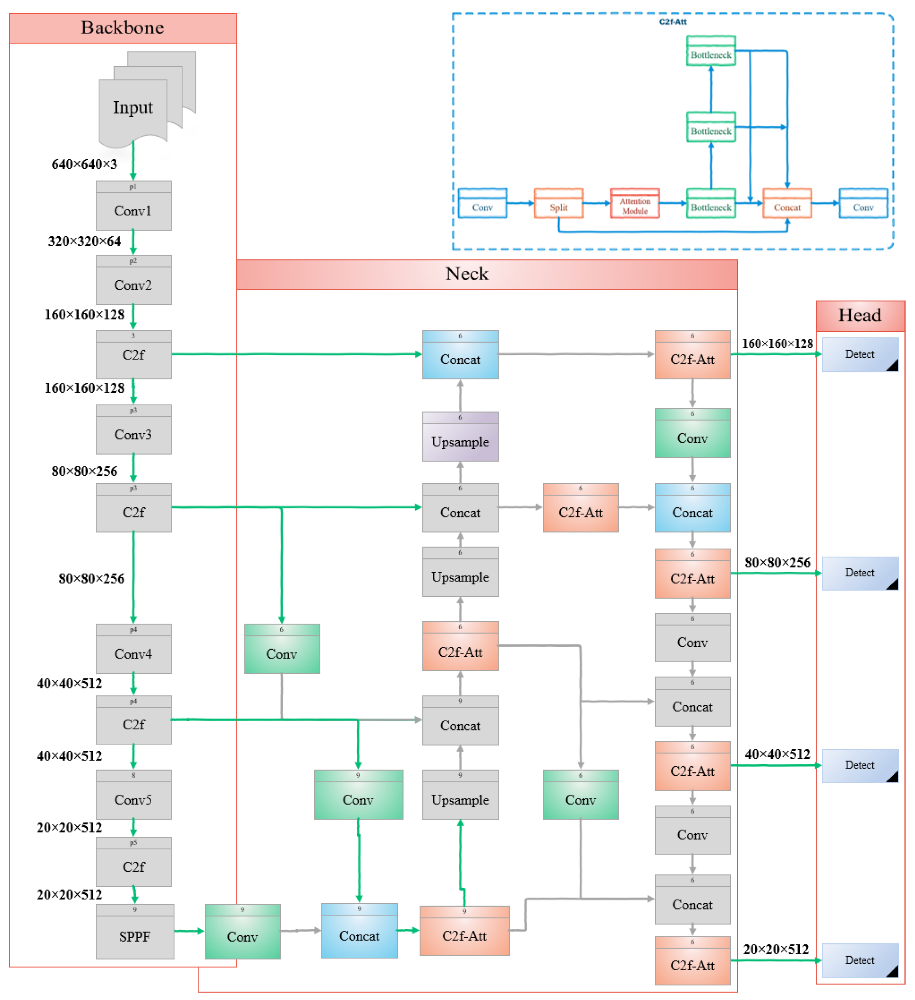

**Paper:** https://dl.acm.org/doi/pdf/10.1145/3694715.3695965

**Repository:** https://github.com/Boshrakh/Yolov8-Small-Object-Detection-Arial-Images

### Constellation

  

**Project Page:** https://mkturkcan.github.io/constellation-web/ 

**Paper:** https://arxiv.org/abs/2404.16944  

**Repository:** https://github.com/zk2172-columbia/constellation-dataset

### Boundless

  

**Paper:** https://arxiv.org/abs/2409.03022v2 

**Repository:** https://github.com/zk2172-columbia/boundless

### CASIM: Composite Aware Semantic Injection for Text to Motion Generation

  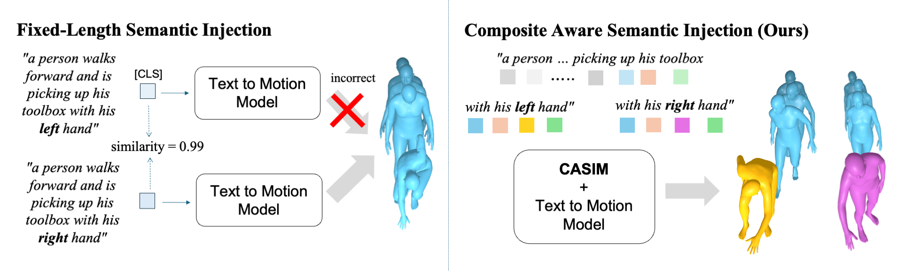

**Project Page:** https://cjerry1243.github.io/casim_t2m/

**Paper:** https://arxiv.org/abs/2502.02063

**Repository:** https://github.com/cjerry1243/casim_t2m

### Pedestrian Crossing Direction Prediction at Intersections for Pedestrian Safety

  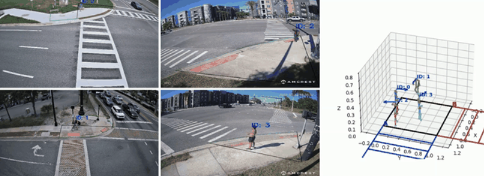

**Paper:** https://ieeexplore.ieee.org/document/11016106

**Repository:** https://github.com/Kimyounggun99/CrossingDirectionPrediction

